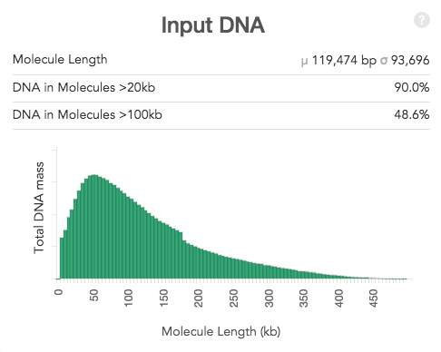
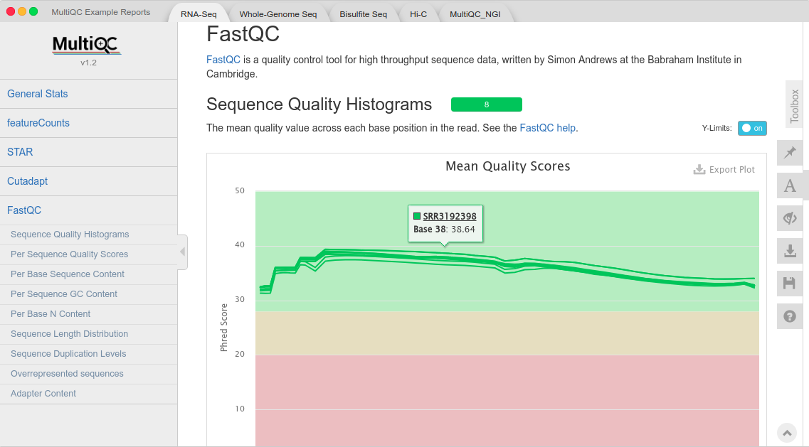
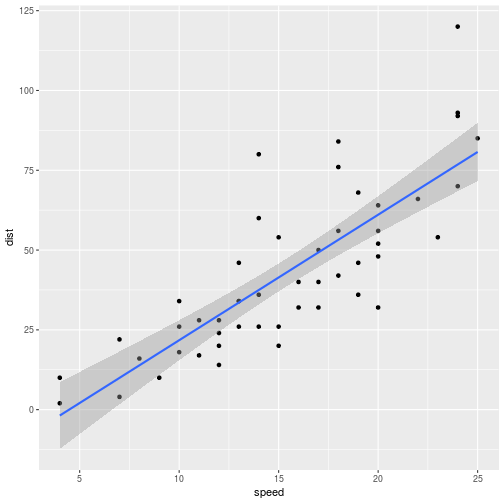

ChromeQC
========================================================
author: S. Jackman, J. Chu, E. Erhan, N. Keivanfar, S. La, S. Menon, T. Mozgacheva, B. Orabi, C. Yang, H. Younesy
date: 2017-10-22
autosize: true

### Summarize sequencing library quality of 10x Genomics Chromium linked reads

Inspiration
========================================================

Loupe from 10x Genomics

- Reports inferred DNA molecule sizes
- Number of barcodes (GEMs)
- Number of molecules per barcode

Some Loupe Stats
========================================================

Input DNA Stats | Barcode Stats
------------- | -------------
 | 

Inspiration
========================================================

FastQC & MultiQC:

- FastQC: Reports base qualities, sequence distribution, GC content, etc
- MultiQC: Aggregate multiple FastQC reports

MultiQC Example
========================================================
 

========================================================
# ChromeQC Pipeline
 

Pipeline: Subsample
========================================================
- From subset of fastq files, and subset of read pairs
- Randomly select 4000 out of ~4M whitelisted barcodes
- Extract reads with selected barcodes for downstream analysis
- Report histrograms of unmatched and of whitelisted barcodes 

Pipeline: Read Alignment
========================================================
- minimap
- GRCh38 reference genome
- Group by barcode, sort by position 

Pipeline: Molecule Size Extraction
========================================================
Heuristic:
- 
- 
Any two reads < 60Kbp away are in the same molecule
- Any reads with same position and orientation are discarded except for one
- 

Slide With Plot
========================================================

